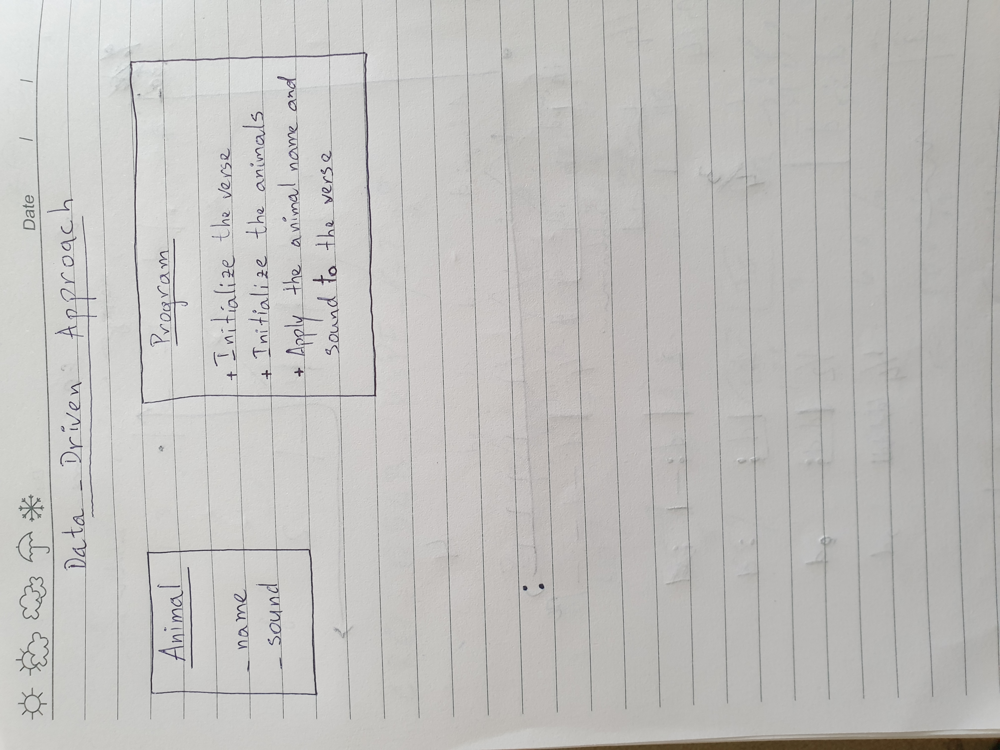
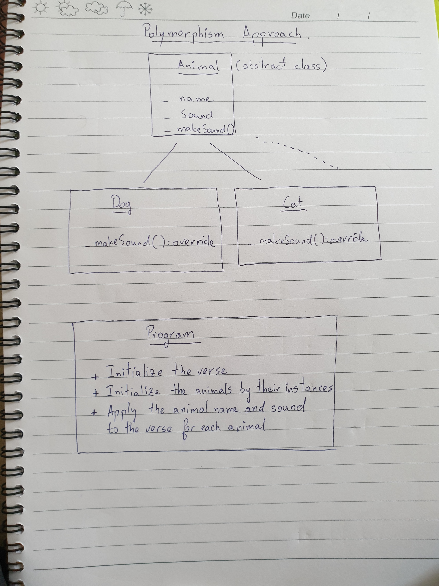

## STM Consulting .NET test BtoBet

Author: NIRIJAONA Lala Ricoeur Khino 
 
Environment: .NET 5.0 
 
Type: Console app.
 

### Solutions Location:
Data-driven modeling Approach: NurseryRhymeDataDriven
 
Polymorphism approach: NurseryRhymePolymorphism

### Answers

#### Question 1:

Class Diagrams for Solutions:
 
Data-driven modeling Approach:

 
Polymorphism Approach:

#### Question 2:
Location: NurseryRhymeDataDriven
 
Class: Program.cs
 
Method: BuildAnimals
 
Region: Question 2.

#### Question 3:
Location: NurseryRhymeDataDriven
 
Class: Program.cs
 
Method: Main
 
Region: Question 3.

#### Question 4: Approach with another version with another language to a non-technical external translated agency
Here are the steps to follow for the program:
- Create an animal object: the object will contains the name and the sound of the animal.
- Store the verse in a variable.
- Apply the verse to any of the animal that you give i.e. replace the animal-name by the name of the given animal in the verse and replace the animal-sound by the sound of the given animal in the verse.